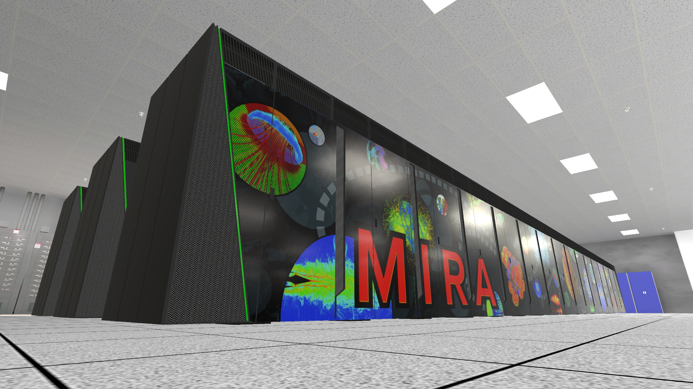

Welcome to my personal website!

Here you find descriptions on my professional projects.

Images coming soon.

## [Augmented Reality Sandbox](arsandbox.md)
My first research project was to create an augmented reality sandbox for NIU's Geography department. Original design was created by Oliver Kreylos at University of California Davis, link here [ARSandbox](http://idav.ucdavis.edu/~okreylos/ResDev/SARndbox/). The projects was organized by Dr. Thomas Pingel at NIU's geography department and funded by the Student Engagement fund at NIU.

---

## 3D Printable Drone Design
I continued to work for Dr. Pingel for about another year. The next thing I worked on for him was the 3D printable drone design. the purpose was to design a drone that was simple and easy to print. The design used flat plates and was bolted together using nylon bolts. after a couple of iterations we created a design that use only 2 different plates. theses plates are mostly flat so they can be printed easily.

---

## Independent study on the Unreal Engine
During my junior year I was able to take a independent study with Dr. Michael Papka. the independent study went over the basics of using the Unreal Engine, as well as some theories and concept on video game development. the lab we did our weekly meetings in had some VR Equipment, so naturally we ended creating some VR games for the final project of the class.

---

## Worked at the DDI Lab for Dr. Papka
I started working for Dr. Papka in his DDI lab doing various projects involving virtual reality and large tiled displays. the first thing I did there was update one of his vr data visualizations made in Unity3D to use the Virtual Reality Tool Kit (VRTK). The original controls for the project were very broken and were hard to use. all of those issues were alleviated when I integrated it with VRTK. My other side project was creating a dynamic perspective camera for Unity3D. Using a HTC Vive tracker or a Vicon tracked object to track the users head relative to the screen. The camera then calculated the corresponding view frustum to use. This gave the effect that the screen was like a "window" into the Unity scene.

---

## Dr. Kirk Duffin computer graphics class
One of my favorite classes at NIU was Dr. Duffin's graphics class. over the course of the semester we were tasked with creating a rudimentary graphics engine in c++. the class covered various topics like drawing algorithms and vertex pipelines. We even covered some topics like texture mapping and shading that we were unable to get to on the project. This class gave an incredible introduction to computer graphics and allowed to continue to study it on my own time without getting lost in the terminology.

---

## [VR internship at Argonne](argonneinternship.md)
I worked at Argonne for the summer of 2018. My job when I was there was to create a virtual reality tour of their datacenter. We used fusion 360, blender and 
paint .net to create all the assets for the project. We used Unity 3D, SteamVR, and VRTK to make the environment and make it interactive. a lot of what i learned at argonne was using different tool together, like fusion 360 and blender, and Git and Unity. Here are some pictures of the project towards its completion.

