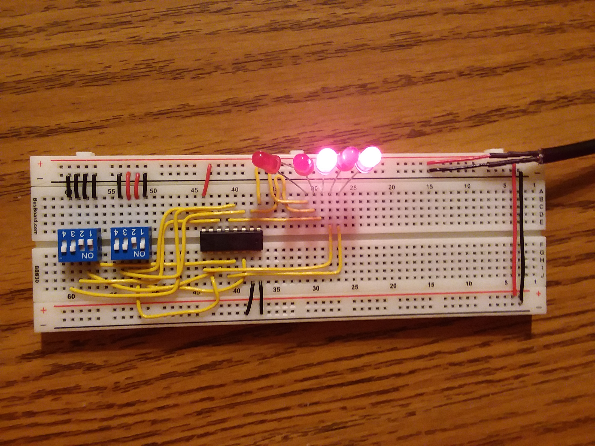
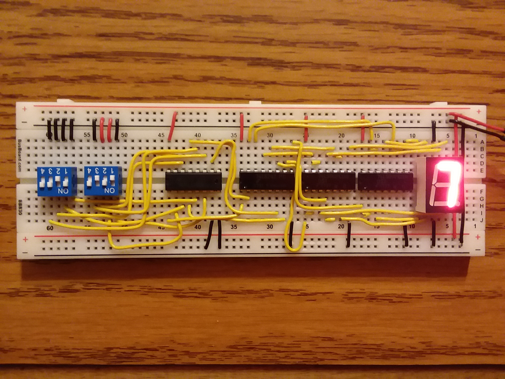

### Here are some early images of my 8-bit computer.

Pictured here is a simple 4-bit ALU.

Pictured here is the 4-bit ALU with 4-bit to 7-segment display decoder. the 74LS247 decoder used here has inverted outputs, so I used 2 74ls00 and gates as inverters to get the correct output.

